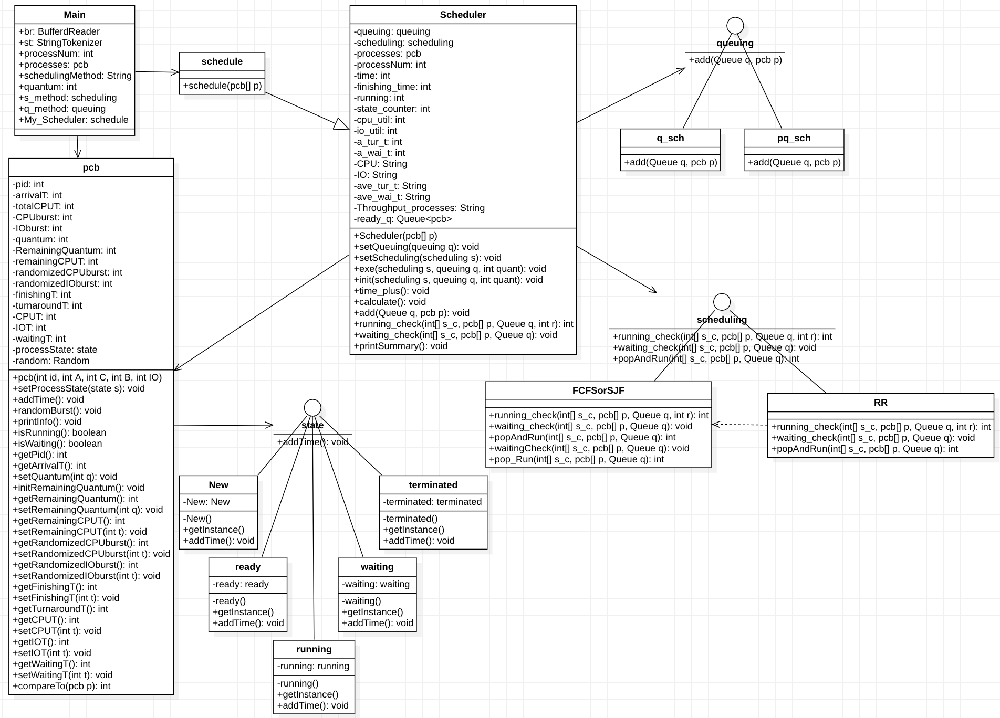
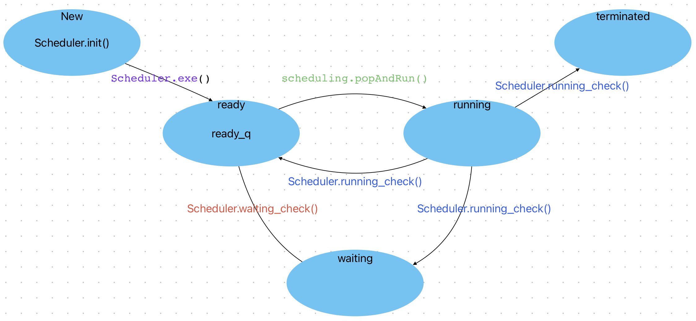

# CPU Scheduling

I implemented FCFS (First-Come-First-Served), SJF (Shortest Job First), and RR (Round Robin) scheduling algorithms in Java.

This implementation is modular and extensible, employing design patterns to improve code organization and maintainability.

- [Class Diagram](#class-diagram)
- [Features](#Features)
- [Usage](#Diagram)
- [Result](#Prerequisite)

## Class Diagram



## Features

1. Simulation of Scheduling Algorithms

- Supports the simulation of FCFS, SJF, and RR scheduling algorithms.

2. Process State Management

- Processes are handled according to the Process State Diagram, ensuring realistic transitions (e.g., Ready → Running → Blocked).



3. Use of Design Patterns

- State Pattern: Dynamically adjusts process behavior based on its current state (e.g., Ready, Running, Blocked), as defined in the Process State Diagram.
- Strategy Pattern: Enables seamless switching between scheduling algorithms (FCFS, SJF, RR) without modifying core process logic.

## Usage

1. Compile

```java
javac -d out ./src/*.java
```

2. Run

```java
java -cp out Main <inputFileName> <schedulingAlgorithm>
// java -cp out Main ./testtxt/test1.txt "FCFS"
```

## Result

- testcase 1~3은 모든 스케쥴링 알고리즘의 결과 값이 같음

- testcase 4는 매번 다른 결과를 출력함

- testcase 1

```java
1 (0 5 1 0)
```

```java
====		Program Summary		====
Finishing Time : 5
CPU utilization : 100.00%
I/O utilization : 0.00%
Throughput in processes completed per hundred time units : 20.00
Average turnaround time : 5.00
Average waiting time : 0.00
===		===		===		===		===
```

testcase 2

```java
1 (0 5 1 1)
```

```java
====		Program Summary		====
Finishing Time : 9
CPU utilization : 55.56%
I/O utilization : 44.44%
Throughput in processes completed per hundred time units : 11.11
Average turnaround time : 9.00
Average waiting time : 0.00
===		===		===		===		===
```

testcase 3

```java
3 (0 5 1 1)(0 5 1 1)(3 5 1 1)
```

```java
====		Program Summary		====
Finishing Time : 15
CPU utilization : 100.00%
I/O utilization : 80.00%
Throughput in processes completed per hundred time units : 20.00
Average turnaround time : 12.67
Average waiting time : 3.67
===		===		===		===		===
```

testcase 4

```java
5 (0 200 3 3)(0 500 9 3)(0 500 20 3)(100 100 1 0)(100 500 100 3)
```

```java
매번 랜덤한 값
```
