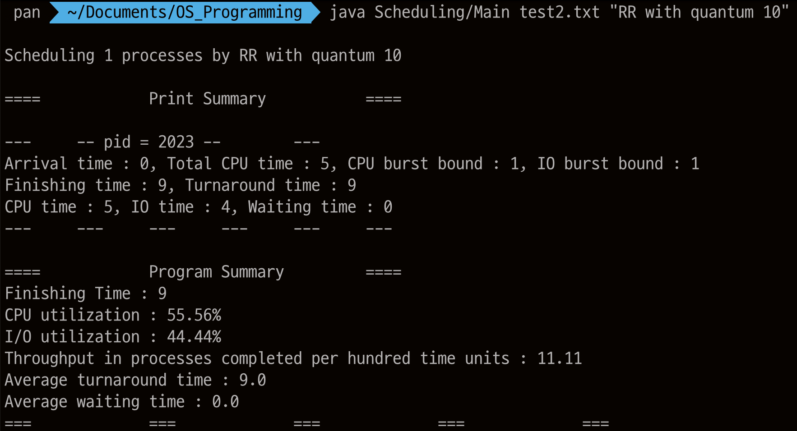

# 운영체제 스케쥴링

FCFS, SJF, RR을 자바로 구현해 보았다.

[결과](https://www.notion.so/806db3c4ed2849f89f5e0adb0a14d86d?pvs=21)

프로세스 상태 다이어그램을 기반으로 스테이트 패턴을 사용해 프로세스 상태에 따라 적절한 값 조정을 해주고 스트레티지 패턴을 사용해 원하는 스케쥴링 알고리즘을 사용할 수 있도록 구현해 보았다.

## 클래스 다이어그램


## 결과


### 요약
testcase 1~3은 모든 스케쥴링 알고리즘의 결과 값이 같음

testcase 4는 매번 다른 결과를 출력함

testcase 1

```java
1 (0 5 1 0)
```

```java
====		Program Summary		====
Finishing Time : 5
CPU utilization : 100.00%
I/O utilization : 0.00%
Throughput in processes completed per hundred time units : 20.00
Average turnaround time : 5.00
Average waiting time : 0.00
===		===		===		===		===
```

testcase 2

```java
1 (0 5 1 1)
```

```java
====		Program Summary		====
Finishing Time : 9
CPU utilization : 55.56%
I/O utilization : 44.44%
Throughput in processes completed per hundred time units : 11.11
Average turnaround time : 9.00
Average waiting time : 0.00
===		===		===		===		===
```

testcase 3

```java
3 (0 5 1 1)(0 5 1 1)(3 5 1 1)
```

```java
====		Program Summary		====
Finishing Time : 15
CPU utilization : 100.00%
I/O utilization : 80.00%
Throughput in processes completed per hundred time units : 20.00
Average turnaround time : 12.67
Average waiting time : 3.67
===		===		===		===		===
```

testcase 4

```java
5 (0 200 3 3)(0 500 9 3)(0 500 20 3)(100 100 1 0)(100 500 100 3)
```

```java
매번 랜덤한 값
```

---

## 결과 스크린 샷

testcase 1

```python
1 (0 5 1 0)
```


---

testcase 2

```python
1 (0 5 1 1)
```





---

testcase 3

```python
3 (0 5 1 1)(0 5 1 1)(3 5 1 1)
```


---

testcase 4

```python
5 (0 200 3 3)(0 500 9 3)(0 500 20 3)(100 100 1 0)(100 500 100 3)
```


## Main.java 해설

```java
if(args.length < 2 || args.length > 5){
            System.out.println("Usage: java Scheduling/Main <inputFileName> <schedulingAlgorithm>");
            System.out.println("available SchedulingAlgorithm : FCFS, SJF, RR with quantum 1/10/100");
            return ;
        }
```

받아오는 args의 갯수가 잘못되면 오류메시지를 출력하고 종료한다.

```java
BufferedReader br = new BufferedReader(new FileReader(args[0]));
StringTokenizer st = new StringTokenizer(br.readLine(),"() ");
br.close();
```

BufferedReader로 파일을 읽고 StringTokenizer로 적절하게 텍스트를 나눈다.

```java
int processNum = Integer.parseInt(st.nextToken());  //number of process
//create process followed by info that got from file
pcb[] processes = new pcb[processNum];
for(int i = 0;i<processNum;i++){
    processes[i] = new pcb(2023+i,Integer.parseInt(st.nextToken()),Integer.parseInt(st.nextToken()),Integer.parseInt(st.nextToken()),Integer.parseInt(st.nextToken()));
}
```

파일에서 받아온 텍스트로 프로세스들을 정의해준다.

```java
String schedulingMethod = args[1];     //get scheduling method name
```

받아온 스케쥴링 알고리즘 이름을 저장해준다.

```java
int quantum = 0;                       //using in RR
try{
    if(args.length>3){
        quantum = Integer.parseInt(args[4]);
    }
}
catch (NumberFormatException ex){
    System.out.println("incorrect quantum");
    return;
}
catch (ArrayIndexOutOfBoundsException ex){
    System.out.println("Usage: java Scheduling/Main <inputFileName> <schedulingAlgorithm>");
    System.out.println("available SchedulingAlgorithm : FCFS, SJF, RR with quantum 1/10/100");
    return;
}
```

라운드로빈에서 사용할 quantum을 받아온다. 받아오는중 잘못되게 입력 받았으면 오류메시지를 출력하고 종료한다.

```java
//variables that set strategy of Scheduler and array that will contain processes
scheduling s_method = null;
queuing q_method = null;
//get strategy variables
switch(schedulingMethod){
    case("FCFS"): {
        s_method = new FCFSorSJF();
        q_method = new q_sch();
        break;}
    case("SJF"): {
        s_method = new FCFSorSJF();
        q_method = new pq_sch();
        break;}
    case("RR"): {
        s_method = new RR();
        q_method = new q_sch();
        break;}
    default: {
        System.out.println("Scheduling method name incorrect");
        System.out.println("available SchedulingAlgorithm : FCFS, SJF, RR with quantum 1/10/100");
        return;}
}
```

스케쥴링 메소드 이름으로 스케쥴링/큐잉 스트레티지를 정해준다

ex) SJF이면 quantum을 사용 안 하는 FCFSorSJF 스케쥴링 스트레티지를 사용하고 RemainingCPUburst의 크기를 기준으로 정렬되는 우선순위 큐를 사용하는 pq_sch 큐잉 스트레티지를 사용한다.

```java
System.out.println("\nScheduling "+processNum+" processes by "+schedulingMethod);
schedule My_Scheduler = new schedule(processes);
My_Scheduler.exe(s_method,q_method,quantum);
```

몇개의 프로세스로 어떤 스케쥴링 알고리즘을 사용하는지 출력하고

스케쥴 클래스를 참조하며 exe메소드를 실행한다.

## pcb.java 해설

중요한 부분만 짚어서 해설하겠음

```java
public void addTime(){
    processState.addTime(this);
}
```

프로세스 상태에 따라 프로세스의 변수 값을 조정한다

아래 state인터페이스에서 자세히 설명하겠음

```java
//put random number up to given Maximum CPU/IO time
public void randomBurst(){
    if(this.CPUburst >0) {
        this.randomizedCPUburst = random.nextInt(this.CPUburst) + 1;
    }
    else{
        this.randomizedCPUburst = this.CPUburst;
    }
    if(this.IOburst >0){
        this.randomizedIOburst = random.nextInt(this.IOburst)+1;

    }
    else{
        this.randomizedIOburst = this.IOburst;
    }
}
```

Random을 이용해 랜덤한 cpu burst/io burst 값을 부여해준다.

이 매소드는 프로세스가 running state에서 cpu burst를 모두 소모 한 후 waiting state에 가고 io burst를 모두 소모하면 ready state로 가는데 이때 실행되어 다시 cpu burst와 io burst를 랜덤하게 부여한다.

```java
@Override
public int compareTo(pcb p) {       //using when enqueuing to priority queue
    if(this.randomizedCPUburst < p.getRandomizedCPUburst()) return -1;
    else if(this.randomizedCPUburst >p.getRandomizedCPUburst()) return 1;
    return 0;
}
```

이후에 사용할 우선순위 큐에서 현재 남은 cpu burst에 따라 우선순위가 부여되여야 하므로 randomizedCPUburst 변수로 비교한다.

```java
interface state {
    //adjust time to each variable according to its state
    public void addTime(pcb p);
}
```

state란 인터페이스를 통해 스테이트 패턴을 사용할 것이고 상태에 따라 다르게 실행될 메소드는 addTime이다.

```java
class running implements state {
    private static running running = new running();
    private running(){}
    public static running getInstance(){
        return running;
    }
    public void addTime(pcb p) {
        p.setFinishingT(p.getFinishingT()+1);
        p.setCPUT(p.getCPUT()+1);
        p.setRemainingCPUT(p.getRemainingCPUT()-1);
        p.setRandomizedCPUburst(p.getRandomizedCPUburst()-1);
        p.setRemainingQuantum(p.getRemainingQuantum()-1);
    }
}
```

state 인터페이스를 실체화한 클래스인 running을 예시로 보며 설명하겠다.

위의 부분은 싱글톤 패턴을 적용한 것이고 addTime에서는 프로세스가 CPU에서 처리되고 있을때를 가정하며 변수의 값을 조정하는 것이다.

finishing time, CPU time는 scheduler에 실행되고 있고 CPU에서 처리되고 있기에 값을 증가시켜주고

남은 전체 CPU time과 cpu burst는 얼마나 더 running state에 남아야 하는지 보여주는 변수이기에 나중에 0이 되었을때를 조건문으로 뒀기에 값을 감소시켜주고

quantum은 라운드로빈에서 사용하게 될 것인데 FCFSorSJF에서는 관련된 조건문이 존재하지 않으므로 RR에서만 영향을 미치게 된다. 이것도 cpu burst처럼 0이 되었을때가 조건문이기에 값을 감소시켜준다.

이런 방식으로 state에 따라 변경하는 시간 값이 다르게 만들어 준다.

## Scheduler.java 해설

```java
public void exe(scheduling s, queuing q,int quant){
        //setting strategy and random burst variables of process
        init(s,q,quant);
        while(this.state_counter[4]<processNum){
            //set arrived process into ready state and enqueue to ready queue
            for(int i = 0; i<this.processNum;i++){
                if(this.processes[i].getArrivalT() ==this.time){
                    this.processes[i].setProcessState(ready.getInstance());
                    this.state_counter[0]--;
                    this.state_counter[1]++;
                    add(this.ready_q,this.processes[i]);
                }
            }
            //set state of process by scheduling strategy
            do {
                this.running = running_check(this.state_counter, this.processes, this.ready_q, running);
                waiting_check(this.state_counter, this.processes, this.ready_q);
            }while(!processes[running].isRunning() && !ready_q.isEmpty());
            //add time and adjust variables of each process by their state
            time_plus();
        }
        //print Info of processes and summary of Scheduler
        calculate();
        printSummary();
    }
```

이 메소드가 중요하므로 순서대로 다 설명하겠음

```java
public void init(scheduling s, queuing q, int quant){
    this.processNum = this.processes.length;
    for(int i = 0;i< this.processNum;i++){
        //set random variables of each process
        this.processes[i].randomBurst();
        this.processes[i].setQuantum(quant);
        this.processes[i].setProcessState(New.getInstance());
        this.state_counter[0]++;
    }
    //set strategy
    setScheduling(s);
    setQueuing(q);
}
```

먼저 프로세스 수를 가져오고 그 프로세스들의 cpu burst, io burst, quantum, state를 설정해주고 state_counter에서 New 프로세스 수를 보관하는 0번째 인덱스에 값을 추가해준다.

그리고 이 스케쥴러의 scheduling 스트레티지랑 queuing 스트레티지를 정해준다.

```java
while(this.state_counter[4]<processNum){
```

프로세스들 모두가 종료되기 전까지 반복한다.

```java
//set arrived process into ready state and enqueue to ready queue
for(int i = 0; i<this.processNum;i++){
    if(this.processes[i].getArrivalT() ==this.time){
        this.processes[i].setProcessState(ready.getInstance());
        this.state_counter[0]--;
        this.state_counter[1]++;
        add(this.ready_q,this.processes[i]);
    }
}
```

모든 프로세스를 확인하여 도착한 프로세스일 경우 ready로 상태를 바꿔주고 ready 큐에 추가한다 그리고 New에서 ready로 프로세스가 간 것이므로 state_counter 값을 조정해준다.

( New → ready)

```java
//set state of process by scheduling strategy
do {
    this.running = running_check(this.state_counter, this.processes, this.ready_q, running);
    waiting_check(this.state_counter, this.processes, this.ready_q);
}while(!processes[running].isRunning() && !ready_q.isEmpty());
```

스케쥴링 스트레티지에 따라서 프로세스들의 상태를 확인하고 적절한 상태로 바꿔주는 메소드를 ready 큐에 프로세스가 존재할 시 CPU에 실행되고 있는 프로세스가 있을때까지 실행한다.

(io burst가 0이여서 running이후에 바로 waiting을 거쳐서 ready로 와야하는 경우를 대비해서 만든 조건)

running_check랑 waiting_check는 이후에 scheduling 인터페이스를 설명할때 제대로 설명하겠다.

```java
//add time and adjust variables of each process by their state
public void time_plus(){
    this.time++;
    //if there's running process, add time to CPU_util
    if(this.state_counter[2]>0){
        this.cpu_util++;
    }
    //if there's waiting process, add time to io_util
    if(this.state_counter[3]>0){
        this.io_util++;
    }
    //adjust variables of each process by their state
    for(int i = 0; i<this.processNum;i++){
        this.processes[i].addTime();
    }
}
```

프로그램의 시간 변수값을 증가시켜주면서 CPU가 사용중이면 cpu_util 값을 증가시켜주고 IO가 사용중이면 io_util 값도 증가시켜준다.

그리고 모든 프로세스들을 프로세스의 상태에 따라 시간을 증가시켜준다.

```java
//print Info of processes and summary of Scheduler
calculate();
printSummary();
```

프로그램의 프로세스를 모두 처리하고 난 후 실행되는 메소드들로

실행되었던 프로세스들의 정보를 계산해서 결과를 변수에 저장하고 (calculate())

출력한다 (printSummary())

이제 스트레티지 패턴을 이용하여 만든 인터페이스를 보면서 스케쥴러가 어떻게 구현되었는지 설명하겠다.

```java
interface queuing{
    // add pcb to ready_queue
    public void add(Queue<pcb> q, pcb p);
}
```

queuing 스트레티지를 보면 q_sch와 pq_sch가 있다.

q는 Queue이고 pq는 PriorityQueue를 뜻하는 것이다.

q_sch는 FCFS,RR같은 먼저 들어오는데로 먼저 실행되는 스케쥴러를 위한 ready큐를 구현하기 위함이고 

pq_sch는 SJF처럼 cpu burst 크기에 의해 순서가 정렬되어야하는 스케쥴러의 ready큐를 구현하기 위함이다.

왜 정렬 알고리즘을 사용하지 않고 굳이 PriorityQueue를 사용한 이유는 java.util.PriorityQueue의 우선순위큐는 우선순위 힙으로서 구현되어있기 때문이다.

cpu burst로 비교해 sorting 할때 만약에 priority queue를 쓸 경우 힙 형태로 만들어져 있기에 추가할때만 O(logn)의 시간이 걸리지만 priority queue가 아니면 최악의 경우 O(n^2)의 시간이 걸릴 수 있다. 게다가 스케쥴링 프로그램 상 CPUburst가 낮을수록 큐에 다시 자주 들어오기에 정렬 되다싶이 큐가 형성되어 있을 가능성이 큰데 이를 보면 quick sort같은 정렬 알고리즘에 최악의 경우의수가 나올 가능성이 커진다 그러므로 프로세스를 ready 큐에 추가할때마다 매번 정렬을 하는 것은 비효율적이고 O(logn)로 힙에 enqueue만 하면 정렬이 되므로 우선순위 큐를 사용하는 것이  가장 효율적이라고 판단하고 사용하였다.

```java
interface scheduling{
    // check running state process and change state according to its variables
    // running -> terminated , running -> waiting , running -> ready
    public int running_check(int[] s_c, pcb[] p, Queue<pcb> q, int r);
    // check waiting state process and change state according to it's variables
    // waiting -> ready
    public void waiting_check(int[] s_c, pcb[] p, Queue<pcb> q);
    // get process index number from ready_queue
    //ready -> running
    public int popAndRun(int[] s_c, pcb[] p, Queue<pcb> q);
}
```

scheduling 스트레티지를 보면 FCFSorSJF와 RR이 있다.

여기의 메소드들은 프로세스들의 상태를 설정해주는 메소드로 프로세스 상태 다이어그램을 통해 보면 쉽게 알 수 있다.


이런 식으로 프로세스 상태를 옮기게 되는것을 인지하고 코드에서 상세히 설명하겠다.

두 scheduling 스트레티지의 waiting_check,popAndRun은 FCFSorSJF에 static으로 선언된 메소드인 waitingCheck, pop_run을 사용하기에 둘이 다른 running_check를 먼저 설명 하고 이후에 설명하겠음

```java
class FCFSorSJF implements scheduling {
    public int running_check(int[] s_c, pcb[] p, Queue<pcb> q, int r) {
        if(p[r].isRunning()){
            if(p[r].getRemainingCPUT() == 0){     // set state into terminated when remaining cpu time is 0
                p[r].setProcessState(terminated.getInstance());
                s_c[2]--;
                s_c[4]++;
                return popAndRun(s_c,p,q);  // return running process index number from ready_queue
            }
            else if(p[r].getRandomizedCPUburst() == 0 && p[r].getRemainingCPUT() != 0){    // set state into terminated when cpu burst is 0
                p[r].setProcessState(waiting.getInstance());
                s_c[2]--;
                s_c[3]++;
                return popAndRun(s_c,p,q);
            }
            else if(p[r].getRandomizedCPUburst() > 0){
                return r;
            }
        }
        else{   // if there's no running process, run process that got from ready_queue
            return popAndRun(s_c,p,q);
        }
        return r;
    }
```

FCFSorSJF의 running_check 메소드부터 설명하겠다.

프로세스가 실행중인 경우 실행중인 프로세스의 남은 CPU time과 cpu burst를 보고 상태를 설정한다. 남은 CPU time이 0일경우 terminated로, cpu burst가 0이면 waiting으로 두고 popAndRun메소드를 통해 ready 큐 제일 앞의 프로세스 인덱스 번호를 받아와 반환한다. 만약에 cpu burst가 남아있으면 원래 프로세스의 인덱스 번호를 반환한다.

실행중인 프로세스가 없으면 popAndRun으로 받아오고 반환한다.

< running → terminated / running → waiting / ready → running >

```java
class RR implements scheduling {
    public int running_check(int[] s_c, pcb[] p, Queue<pcb> q, int r) {
        if(p[r].isRunning()){
            if(p[r].getRemainingCPUT() == 0){
                p[r].setProcessState(terminated.getInstance());
                s_c[2]--;
                s_c[4]++;
                return popAndRun(s_c,p,q);
            }
            else if(p[r].getRemainingQuantum()==0 && p[r].getRandomizedCPUburst() > 0 && p[r].getRemainingCPUT() != 0){  // if quantum is over, set process state into ready and add to ready_queue
                p[r].setProcessState(ready.getInstance());
                p[r].initRemainingQuantum();                    // initialize Remaining Quantum of process
                s_c[2]--;
                s_c[1]++;
                q.add(p[r]);
                return popAndRun(s_c,p,q);
            }
            else if(p[r].getRandomizedCPUburst() == 0 && p[r].getRemainingCPUT() != 0){
                p[r].setProcessState(waiting.getInstance());
                p[r].initRemainingQuantum();
                s_c[2]--;
                s_c[3]++;
                return popAndRun(s_c,p,q);
            }
        }
        else if(!p[r].isRunning()){
            return popAndRun(s_c,p,q);
        }
        return r;
    }
```

RR의 running_check 메소드는 terminated랑 waiting으로 상태를 설정하는 조건문은 같고 ready로 보내는 조건문이 추가되었으므로 이 조건문을 설명하겠다.

quantum을 확인해 qunatum이 0으로 모두 소모되고 cpu burst가 남아있다면 ready 상태로 설정하고 다시 프로세스의 quantum값을 초기화하고 ready 큐에 추가 해준다.

< running → terminated / running → ready / running → waiting / ready → running >

```java
public static void waitingCheck(int[] s_c, pcb[] p, Queue<pcb> q) {
    for(int i=0;i<p.length;i++){
        if(p[i].isWaiting()){       // check every process whether is waiting
            if(p[i].getRandomizedIOburst() ==0){            //if io burst is 0, set process state into ready and add to ready_queue also give random cpu burst and io burst
                p[i].setProcessState(ready.getInstance());
                s_c[3]--;
                s_c[1]++;
                p[i].randomBurst();
                q.add(p[i]);
            }
        }
    }
}
```

waiting_check 메소드에서 불러오는 waitingCheck메소드이다.

모든 프로세스들을 확인하며 프로세스가 waiting state면 io burst를 확인하고 0인 경우 ready 상태로 설정하고 cpu burst와 io burst값을 다시 설정한 후 ready 큐에 추가해준다.

```java
public static int pop_Run(int[] s_c, pcb[] p, Queue<pcb> q) {
        if (!q.isEmpty()) {
            for(int i = 0;i<p.length;i++) {
                if(p[i].getPid() == q.peek().getPid()){      //set process state into running that got from ready_queue
                    p[i].setProcessState(running.getInstance());
                    q.poll();
                    s_c[1]--;
                    s_c[2]++;
                    return i;
                }
            }
        }
        return 0;
    }
```

popAndRun 메소드에서 불러오는 pop_Run 메소드이다.

ready 큐가 비어있지 않을때 ready 큐 제일 앞의 프로세스의 pid와 같은 프로세스의 상태를 running으로 바꿔주고 ready큐에서 프로세스를 제거한다. 그리고 running state로 보낸 프로세스의 인덱스 번호를 반환한다.

---

[Intellij 자바 파일 터미널로 실행하는 법](https://www.notion.so/Intellij-8e8405e14d6d4c0390454d5b6ea18609?pvs=21)